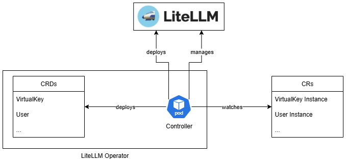

# LiteLLM Operator

!!! warning "This project is archived"

    BBD is no longer maintaining this operator. Other LiteLLM operator projects have more time for support and ongoing maintenance, and that is where new work should go. We recommend [PalenaAI/litellm-operator](https://github.com/PalenaAI/litellm-operator) ([documentation](https://litellm-operator.palena.ai/)).

    Charts and images already published from this repository stay available. There will be no further fixes or features here. Palena's custom resources use the `litellm.palena.ai` API group, so moving to it is a migration rather than a drop-in chart upgrade.

A Kubernetes operator for managing [LiteLLM](https://github.com/BerriAI/litellm) resources in your cluster.

## Overview

The LiteLLM Operator simplifies the management of LiteLLM resources in Kubernetes environments by providing custom resource definitions (CRDs) and controllers for:

- **Virtual Keys** - API key management for LiteLLM proxy
- **Users** - User account management and authentication
- **Teams** - Team-based access control and organization
- **Team Member Associations** - Relationships between users and teams

## Architecture

The operator is designed to work alongside your LiteLLM deployment, providing a Kubernetes-native way to manage authentication and authorization resources.



## Key Features

- 🔐 **Secure API Key Management** - Create and manage virtual keys for LiteLLM proxy access
- 👥 **User Management** - Define and manage user accounts with role-based access
- 🏢 **Team Organization** - Group users into teams with shared permissions
- 🔗 **Association Management** - Flexible user-team relationships
- 🚀 **Kubernetes Native** - Built using the Operator SDK with standard Kubernetes practices
- 📊 **Observability** - Built-in metrics and monitoring capabilities

## Quick Start

Ready to get started? Check out our [installation guide](getting-started/installation.md) to deploy the operator in your cluster.

```bash
# Helm - from OCI registry (recommended)
helm install --namespace litellm litellm-operator oci://ghcr.io/bbdsoftware/charts/litellm-operator:<version>

# Helm - from local chart
helm install --namespace litellm litellm-operator ./helm

# Kustomize - from local chart
kubectl --namespace litellm apply -k config/default
```


## Community

- 🐛 [Report Issues](https://github.com/bbdsoftware/litellm-operator/issues)
- 💬 [Discussions](https://github.com/bbdsoftware/litellm-operator/discussions)
- 🤝 [Contributing](developer-guide/development.md)

## License

This project is licensed under the Apache License 2.0 - see the [LICENSE](https://github.com/bbdsoftware/litellm-operator/blob/main/LICENSE) file for details. 
